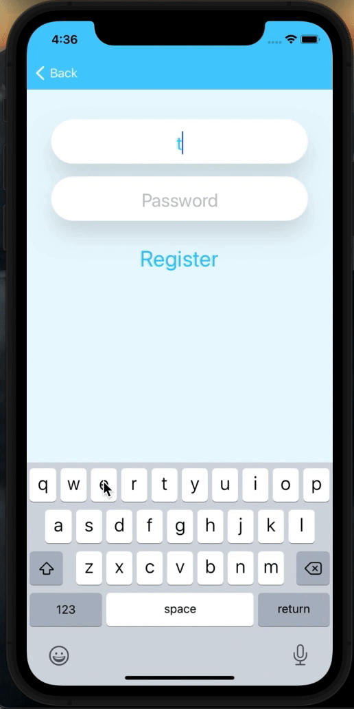
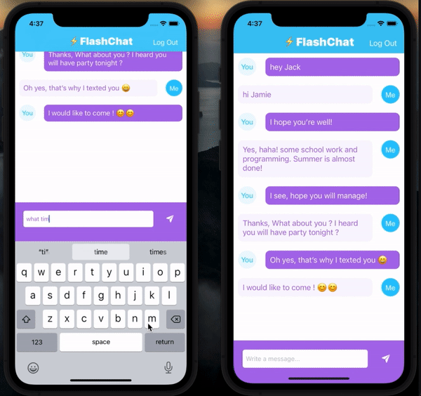

# iOS Swift Flash Chat App

[](https://swift.org)
[](mailto:valikhanli.elnur@gmail.com)
[](https://www.linkedin.com/in/elnur-valikhanli-22249b198/)

Flash Chat App for iOS is a real time chat app written in Swift 5 using Firebase.

## Overview

Flash Chat App allows to send and receieve text messages instantly between two users. The project inteded to cover one of the most fundamental component of modern iOS Applications which is Table View. Table views are widely used in applications and they are bread and butter for every iOS Developers. Apart from that, creating custom cells, and making our own cloud-based backed database on Firebase Cloud Firestore make application user friendly and store necessary information securely on cloud. The App has been made based on Angela Yu's "iOS & Swift - The Complete iOS App Development Bootcamp" Udemy course. Extra optimizations and custom functionalities have been implemented by me.

   

## Prerequisites

First of all, make sure you have met the following requirements:

- You have installed the latest version of Xcode. (Above Xcode 12 Recommended)

- iOS Swift Flash Chat App works for the iOS devices from iOS 11 and above.

NOTE: Please install the latest pod version on your Mac to avoid integration issues

Run the below commands in your terminal:

```bash

sudo gem update cocoapods --pre
pod update
clean
build

```

## Installing iOS Swift Flash Chat App

1. Clone the project from [ios-swift-flash-chat-app](https://github.com/cometchat-pro-samples/ios-chat-ui-kit-app/archive/master.zip) repository. After cloning the repository:

2. Kindly change the Bundle Identifier to match your personal domain.

3. Go to [Firebase](https://firebase.google.com) and create new project.

4. Choose iOS icon, under "Add Firebase to your iOS app" option, add the Bundle Identifier and click continue.

5. Download "GoogleService-Info.plist" file and add to the project. Ensure file name is "GoogleService-Info.plist".

6. Go to [Firebase Console](https://console.firebase.google.com), select your project, choose "Authentication" from left menu, select "Sign-in method" and enable "Email/Password" option.

7. Navigate to project's folder and run below command in terminal to install the required dependencies.
   
   ```
   $ pod install
   ```

4. In case you're facing any issues while installing pods, then please use the below command to install dependencies.
   
    ```
   pod install --repo-update
   ```

5. Build and run the Sample App.

## Contributor

[Elnur Valikhanli](https://github.com/ElnurHello)

